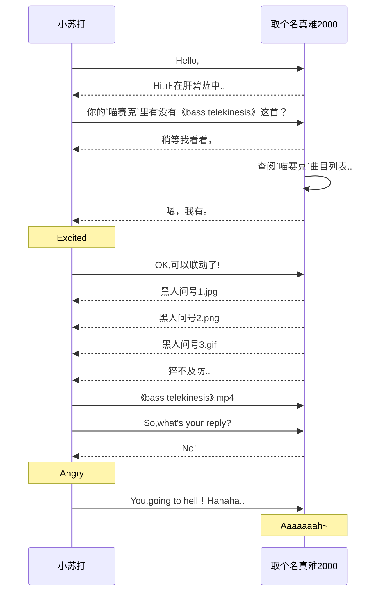

# 1月、2月、3月、4月（2019.01.01 - 2019.04.30）

# 1月、2月、3月、4月（2019.01.01 - 2019.04.30）

<b>2019-01-24</b>

凌晨24点，准备入睡的我打开网易云的小冰电台，一首音乐响起，我静静地听着，越听越觉得诡异，实在忍不住打开屏幕瞅了瞅，看到曲名《The Ghost》，生怕我不知道什么意思，还加了一个括号，里面写着“幽灵”：  本来事情也不大，我换了一首便安静地睡去了，没睡多久，感觉周围总有一群人围着我，好热闹，我索性把灯打开，什么都没变，终于安心地睡了zzZ 天亮了，天亮了，地球又转一圈了，世界还活生生地存在着，还活着，没想到我还活着...日间通过听歌记录找到了那首音乐，分享给大家：[The Ghost](https://music.163.com/song/28855552)（请务必在夜晚食用） 后来我查了查专辑，发现是纪念碑谷的BGM，于是又找到了一款优秀的游戏2333

---

山谷曾为 人之居所 而今前人的辉煌 只化作纪念 窃贼公主 为何您又归来 朽骨暗夜 静候多时 沉默的公主 您已徘徊多远 不知您到此所为何事 朽骨已在掩埋的宅邸中躺了多久 几何神功 成也是它 败也是它 但纪念碑 将于此山谷中 永垂不朽 几何神功的窃取者早已迷失自我 在诅咒下 他们行走于这些纪念碑之间 

<b>2019-03-15</b>

**01#** Today is 消权日. **02#** 上午因为某些原因使得a²情绪高涨，想要发泄出去，于是做了一些比较极端的事情，本来a²也清楚要选择正确的方式排解情绪，然而当时还是没能控制住，造成了一定的影响，包括前两天晚上把墙壁打穿了一个洞。[^3.15] **03#** 科研船终于还剩一艘啦！我的肝终于能放一天假了！(๑乛◡乛๑)

[^3.15]: 那天晚上我体内的情绪已经积压到快溢出了，于是就对着墙壁狠狠地击打了若干下，然后，然后，墙壁（因该是隔板）太脆弱了，被我打穿了一个洞...

<b>2019-03-16</b>

又加班了一天. 还下着大雨. 晚20:00室友小海已经在网吧了, 于是我也去网吧日常直播, 我去了新家附近的网吧, 然而令我没想到的是, 网吧里的设备有很多问题, 比如小海旁边的机子显示器一直黑屏, 之后我又来回换了三台机子, 第一台声音有问题, 第二台话筒有问题, 第三台.. 在换机前买了点土豆块, 后来才知道下机的时候点击了换机按钮, 钱会一直扣除中, 而且老板居然没说办理会员要交30元, 我以为没有会员只给了20元, 真是一次不愉快的体验.

<b>2019-03-17</b>

<b>【今日主要事宜】</b>  【01】办理宽带业务[^3.17.1] 【02】KTV[^3.17.2] 【03】晚间活动[^3.17.3]

---

[^3.17.1]: 首先前一天计划着10:00去办理，结果室友小海睡过了，11:00才起来，简单整理后一起出门办理业务。然而出了一点小故障，原本可以在a2原来的账号上更换新的套餐，下午就能够解决，结果我的套餐绑定了不知道什么套餐，无法更换，只能重新办一张卡，思来想去，我们只好先退出了营业厅，吃了一顿午饭准备后面的事宜～sct
[^3.17.2]: 上周搬完家就打算请室友一起唱歌的，然而还是因为时间以及各种各样的问题推迟到这周。在美团预订好后直接在前台办理，效率还挺高。原本计划着我俩每人各一首，结果小海唱了几首就不唱了，似乎没什么歌想唱，又似乎有点累了，没关系，这次我准备充分，后面的时间几乎都被我包揽了下来。按照惯例先来了一堆Jay Chou的歌曲，接着又是一堆fripSide的日文歌(虽然基本都不怎么会唱就是了),最后又是几首英文,中途还玩了一下RM,展现了自己的操作,还好没Miss,评价SS[doge]
[^3.17.3]: 18:00pm,KTV结束后,小海说要去网吧,我自己先回去了.晚饭时间大约在20:00pm,这期间我把房间里的电线处理好了,胶带有点松,是不是还是会断,真令人头大[doge] 把这周工作日下载好的绅士图食用了一下,一开始还有点感觉,结果往后就没什么感觉了[doge] 晚饭,我以为要去哪个饭馆解决的,结果却是买了一堆零食和卤肉再加一个鸡头[doge] 回去后吃着吃着发现没水喝,准备自己烧水,结果又跟着室友一起买了一大瓶农夫山泉[doge] 他一口气买了两瓶,还说每天回来喝一点,每天喝不到1元,我也就接受了,又买了两瓶牛奶一袋花生[doge] 回去慢慢享用咯~

<b>2019-03-18</b>

才发现佐咲紗花为很多galgame唱过主题曲～ 今天开始补《黑之宣告》 诶女主不错, 声线也很喜欢, op好像听过, 原来是fripSide, 设定好像在哪见过, 剩下的我就记录进bangumi里面了~ 总之今天先这样吧~

<b>2019-03-20</b>

今天的工作怎么那么难啊 每次打开黑暗料理王我都会想起天国的美味小镇 真叫人浴霸不能

<b>2019-04-08【月曜日】</b>

注册了一个帐号准备发帖问问， 结果抛出了异常———— 距离能够发帖还有 **14362** 秒。

<b>2019-04-09【火耀日】</b>

<b>2019-04-10【水曜日】</b>

今天做了一个重要的决定———— 给为知续费了一个月(๑乛_乛๑) 这也就表示———— 可能要放弃印象了 继续用为知， 所以今天花了一下午的时间又把印象的文档转移到为知(๑乛_乛๑) 其实也没那么多， 只是拷贝了一下图片链接而已， 毕竟这些日记都保留在为知上面~

<b>2019-04-11【木耀日】</b>

昨天的按键计数———— 键盘按键：6318 次 鼠标左键：7263 次 鼠标右键：65 次 鼠标滚轮：8430 格 鼠标移动：61264.1 厘米

* * *

今天的按键计数———— 键盘按键：16629 次 鼠标左键：7628 次 鼠标右键：65 次 鼠标滚轮：8813 格 鼠标移动：64720.3 厘米

* * *

今晚形象礼仪课程结业， 每位学员为大家演示了一遍茶道， 包括自己~ 茶真好喝~ 第一次知道喝茶也能喝醉~

<b>2019-04-12【金曜日】</b>

一大早四人小组就去交任务~
当然我这次没去~

* * *

等了三四天快递终于到达了， 结果收到快递后只有20包， 问了淘宝才知道是分批次发过来的， 还有这种操作！？ 

* * *

扎心了( ´_ゝ｀) 

* * *

古典FM给我推荐97键盘轮舞曲， 这又是啥操作！？( ´_ゝ｀) 

* * *

今日按键次数统计———— 键盘按键：9967 次 鼠标左键：6089 次 鼠标右键：100 次 鼠标滚轮：7491 格 鼠标移动：46404.9 厘米

<b>2019-04-13【土曜日】</b>

直播的时候打出了一个整齐的分数 922222(๑乛◡乛๑) 

<b>2019-04-14【日曜日】</b>

## 上午完成了两个自制谱
一首《さくらの季节》 经过原RM自制谱改编， 原谱面比较简单， 于是乎osu谱被a²塞爆了(๑乛◡乛๑) （正常游戏的情况下Miss总数为233） 另外一首《Invitation》 也是由RM自制改编而来， 被a²改成了变速谱， 总算是摸清了变速谱的制作规则， 就是比较麻烦， 有时候还容易搞错， 不过还是完工了， 算是填上了一个坑， 以后再慢慢摸索摸索(๑乛◡乛๑)

* * *

## 下午去了一趟新都
自从搬来成都这边就没怎么去过新都， 尤其是过年后， 跟那边的同学也没怎么联系， 随着春天慢慢流逝， 夏天也快要到了， 我还有一堆衣物放在新都， 所以下午才过去搬过来， 令我没想到的是， 那位同学依然还住在原来的地方， 当然还是跟原来一样， 自从我离开后就没打扫过屋子， 我一到新都就去吃了铁板炒饭(๑乛◡乛๑) 毕竟搬出来后就没吃过那边的炒饭了， 不如说来新都就为了吃一顿炒饭（笑） 据那位同学所说， 他在上周就把工作辞了， 明天还有新的面试 我一边大吃一惊一边询问具体事宜， 无非就是不会做不相干之类的， 我也算是清楚了大致原由 就在他请我喝完一杯奶茶后送我离开时， 不偏不倚地撞见了另外两位同学， 于是又跟他们一起吃了晚饭 （我很饱所以没吃） 接着天色也暗了下来， 我跟着小昊童鞋坐地铁一起回成都~ 晚上又去周围逛了逛准备买瓶墨水 谁知转了一大圈， 一个文具店都没得 只得在淘宝上买了一个(๑乛_乛๑) 回到家又把钢笔清洗了, 之后跟网友一起osu osu真好玩(๑乛◡乛๑) 今天就这么过去了

* * *

## 半夜看电视剧到凌晨5点
连a²自己都想不到， a²居然会去看《巾帼枭雄之义海豪情》 剧情紧凑，变幻莫测，捉摸不定， 一口气看了6集， 一直到凌晨5点才睡， 刚好把"吔屎啦 梁非凡"看完(๑乛◡乛๑)

<b>2019-04-23【火】</b>$\color{#009B6B}\text{【难度】☆}$

4月23日不仅是世界读书日，也是中国海军节。中国海军在青岛及其附近海空域举行各国海军舰艇海上阅兵——新闻中拍到了我在青岛买的公寓，当时的内心十分激动\~

另外也收到了小礼物(๑乛◡乛๑)

只要坚持不懈地努力，总是能够实现伟大的梦想的！ 

但为什么文字是反着的??(๑乛_乛๑)  

* * *

今天发现了一个有趣的扩展名&nbsp;`.ova`：  之前一直没注意，看来是我孤陋寡闻了。。

而且我还发现了一种加入图片的方式，简单说就是把图片转换为BASE64编码，把编码直接放入图片的URL中，上面这张图就是这样做的，当然这种方式也存在着很大的弊端，比如编码本身就比图片占用更多的内存，体积小一点的图片还能适用，若是大体积的图片，啧啧啧。。还是图床靠谱-sct

* * *

$\color{#00f}{找到了一个新的方式为文字添加颜色!}$

还能使用更丰富的颜色: $\color{#4285f4}{更}\color{#ea4335}{丰}\color{#fbbc05}{富}\color{#4285f4}{的}\color{#34a853}{颜}\color{#ea4335}{色}$

这也算是一种隐藏功能吧(๑乛◡乛๑)

<b>2019-04-24【水】</b>$\color{#009E96}{【难度】★}$`

曾几何时，日记的难度系统已经被窝取消了，因为在那之后的日记是非共享性质的，也就是说只有我自己能看得到，当然如果公开出来也不影响，然而今天我又开始重新考虑这个问题了——那么难度系数应不应该重新加上呢，深思熟虑后我觉定还是加上~ 而且目前来说，印象笔记还没有完全支持Markdown，若哪天彻底支持了，我就立刻把笔记迁移过去~ 忙碌了一添，发现一个实用的教城：[有道云笔记去广告教程](https://weibo.com/ttarticle/p/show?id=2309404294772469706130) 使用之后真的把广告去除了~ 其实两天前看过一篇文章：[谈谈为知笔记的Markdown功能](https://sspai.com/post/37275) 这样便很清晰地解释了为什么每次我打开笔记的时候总会先显示源码，再渲染成应有的样式----看来也该找个替代的产品了~ 而且现在分享一篇为知笔记时总要审核一番，至于审核我倒是不担心不会不通过，而是这个流程，为知的逻辑是这样的：先审核，通过后才能看到内容，最关键的一点，审核的时间是不定的，可能一分钟，也可能一个小时，前者还能接受，若是后者，我可能就要重新选择产品了~

<b>2019-04-25【木】</b>$\color{#00A0C1}{【难度】★☆}$

Today is a Sunny Day. 困扰我多天的一个， 不，两个问题终于解决了~ 其中一个问题就是难度表的颜色~ 参考了LATEX语法格式后， 我才发现原来要加上代码块的标识符， 另外一个问题， 我就用下面这个例子演示一遍， 依然是之前那个例子：

当然这只是一个例子，并非真实情况
***
不幸的事发生了，同事 $\color{#8A2BE2}\text{小宇}$ 今早去医院做了各项检查，下午过来后收拾东西打算回ChongQing做手术，居然这么突然，据他索说，20天前便出现了征兆，昨天实在受不了，结果今天检察后才知道已经很严重了，恐怕今后是干不了这一行了，准备转行经商。这么一说，a&sup2;不禁开始反思起莱，身体才是硬件，不管技术再优秀，都是软体，都是没用的，医生还对 $\color{#8A2BE2}\text{小宇}$ 说，你这么年轻就已经这样了，再过不久链路也走不动了，看来确实挺严重的，今后只能有缘再见咯~
***
于是整个下午a&sup2;就在整李申请资料，中途需要打印申请表，拿出了快要落满灰尘的U pan，万万没想到不管哪个USB街口都无法写入数据，万般无奈之下只好进行了格式化，顺便修改了文件系统(๑乛◡乛๑) 格式化完毕后瞬间就能正常读写数据了,心情复杂~ 
***
不知不觉四月也快结束咯~ 今天的气温居然高达89.6℉， 这还没到五月呢， 难道说是夏天来临的蒸兆？ 希望雨季也快点降临吧~
***

Lanota更新，于是a&sup2;又把Deemo装回来了，果然还是低速适合我(๑乛◡乛๑)

已折叠多张图片

***
第一次得到两张彩色图纸，后来才知道装备图纸需要集齐50张才能合成，这得到猴年马月了。。。 

***

今天再来测试一下gif动图的效果： 

